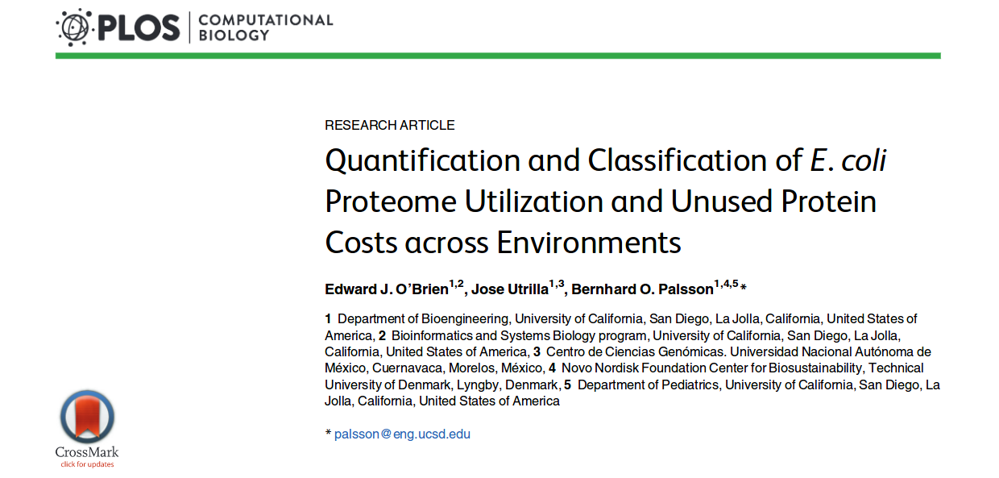
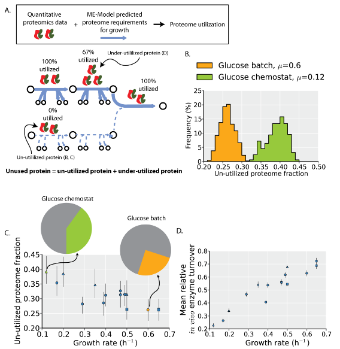
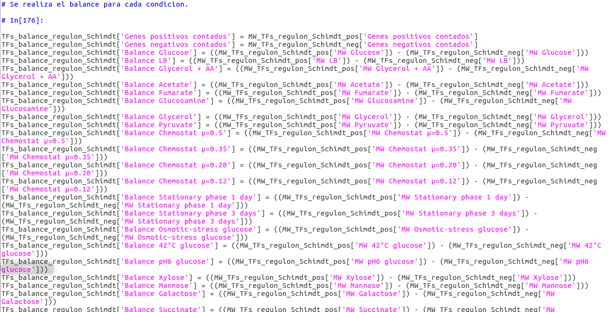

# Tarea 1:
## Reproductibilidad de un artículo 
### Artículo:[Quantification and Classification of E. coli Proteome Utilization and Unused Protein Costs across Environments](http://journals.plos.org/ploscompbiol/article?id=10.1371/journal.pcbi.1004998)

En este artículo, los autores reportan haber utilizado **datos proteómicos** de _E. coli_, junto con una **herramienta computacional** para determinar el porcentaje del proteoma que es desperdiciado al no usarse a través de 16 condiciones distintas.

#### **Ventajas**
- Al reducir la expresión de proteinas no usadas, es posible acelerar la tasa de crecimiento celular.
- Al reducir la carga del proteoma, es posible destinar esos recursos energeticos a ciertas funciones vitales.
- Nos abre a la posibilidad de manipular a la célula a través de la biología sintética para insertar nuevas funciones celulares.

### ¿Se puede reproducir?
Al leer el articulo, y consultar la sección de metodos, los autores no tienen ningun problema en decirnos que sets de datos usaron, los estadisticos que utilizaron, las condiciones de los medios y las condiciones bajo las que se hicieron las simulaciones.

##### En el artículo, los autores nos muestran esquemas, graficos y estadisticos de sus resultados, así como material suplementario, pero en ningun momento nos muestran o nos comparten el codigo de la herramienta computacional que utilizaron para determinar la carga de proteoma sin utilizar a través de las 16 condiciones.

Teoricamente, con los sets de datos y las condiciones que utilizaron los autores, es posible determinar la carga del proteoma sin utilizar, sin embargo, al no contar con el **codigo original** de la herramienta computacional, es muy probable que los resultados obtenidos por los autores difieran de los resultados que nosotros pudieramos obtener.

##### Sin embargo...

tuve la fortuna de integrame en este proyecto, y fui yo quien desarrollo la herramienta computacional. 

Por lo que se de primera mano, que seria dificil el que alguien mas llegara a los mismos resultados que nosotros, aunque no imposible, pero los resultados dependerian del pipeline de los datos, así como del lenguaje de programación, y los paquetes adicionales usados para el análisis.

Si bien, en las ciencias computacionales es posible reproducir un experimento, no garantiza la obtención de los mismos resultados.

##### Referencias
O’Brien, E. J., Utrilla, J., & Palsson, B. O. (2016). Quantification and classification of e. coli proteome utilization and unused protein costs across environments. PLoS computational biology, 12(6), e1004998.
